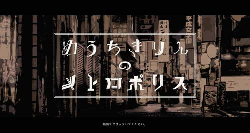
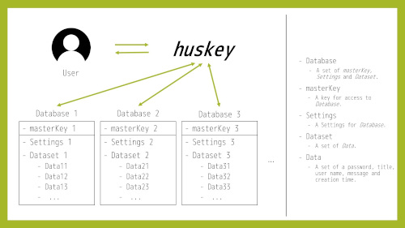

## めうちきりんのメトロポリス

カットアップや自然言語処理といった知見を活用し、プログラムによって自動生成された文章を用いて制作された、ショートショート形式のサウンドノベルゲーム。

使用技術: JavaScript (Vue.js), Rust (tauri)

HP: [https://myochikirin-hp-403bf.web.app/](https://myochikirin-hp-403bf.web.app/)  
リポジトリ: [https://github.com/ippee/myochikirin_no_metropolis](https://github.com/ippee/myochikirin_no_metropolis)

## huskey

Java製クロスプラットフォーム・CUIパスワードマネージャー（開発中）。

使用技術: Java

リポジトリ: [https://github.com/denx-official/huskey](https://github.com/denx-official/huskey)

